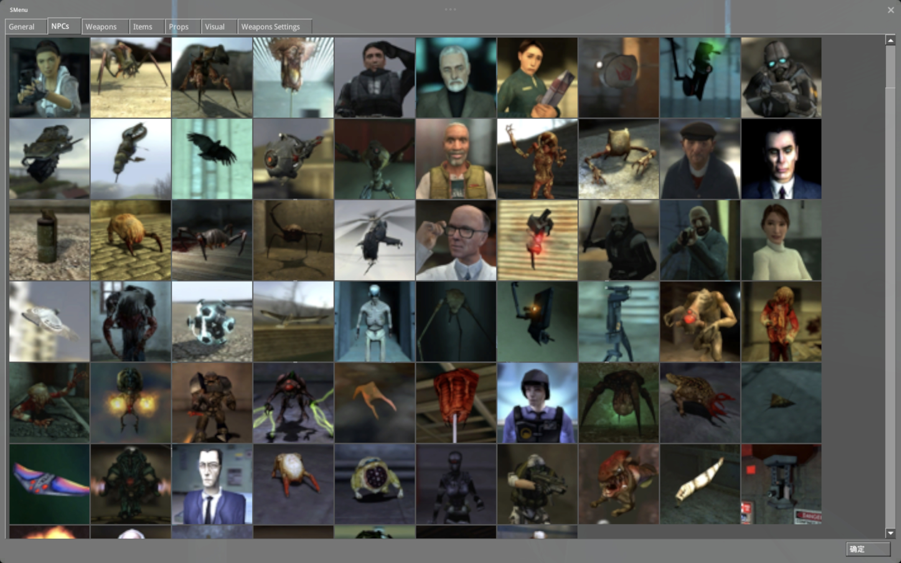

### source-engine-zmod

---
## 预览图
| 🫠 | 🤯 |
|----------|----------|
|  |  |
---
## 如你所见 以下是对此仓库の介绍

```
Source is a 3D game engine developed by Valve.
It debuted as the successor to GoldSrc with Half-Life: Source in June 2004,
followed by Counter-Strike: Source and Half-Life 2 later that year.
Source does not have a concise version numbering scheme; instead, it was released in incremental versions

Source code is based on TF2 2018 leak. Don't use it for commercial purposes.

This project is using waf buildsystem. If you have waf-related questions look https://waf.io/book
```

# 特性
- 支持 Sandbox 菜单（ZZHのlife：优化内容 修改为全屏菜单 优化布局）
- 支持 gamepadui
- 成就系统支持
- 剩下的/2376780283/source-engine 有提到

# 未来工作
- 尝试支持lua系统（hl2sb）
- 完善优化gamepadui
- 支持更多骨骼数量（hl2原版限制120个）
- 剩下的 2376780283/source-engine 有提到

# 详细
- 此仓库代码部分来源于 hl2sb 和 sandbox 感谢其开发者
- 此模组不完善 可以说是速成mod 为了极快达到仿照gmos的模组（garrysmod）
- 此仓库仅供参考 剩下的 /2376780283/source-engine 和 nillerusr/source-engine 有提到

- # How to Build?
- [Building instructions(EN)](https://github.com/nillerusr/source-engine/wiki/Source-Engine-(EN))
- [Building introduction(CN)](https://github.com/2376780283/source-engine-mod-gamepadui/wiki/Source‐Engine‐(CN))
